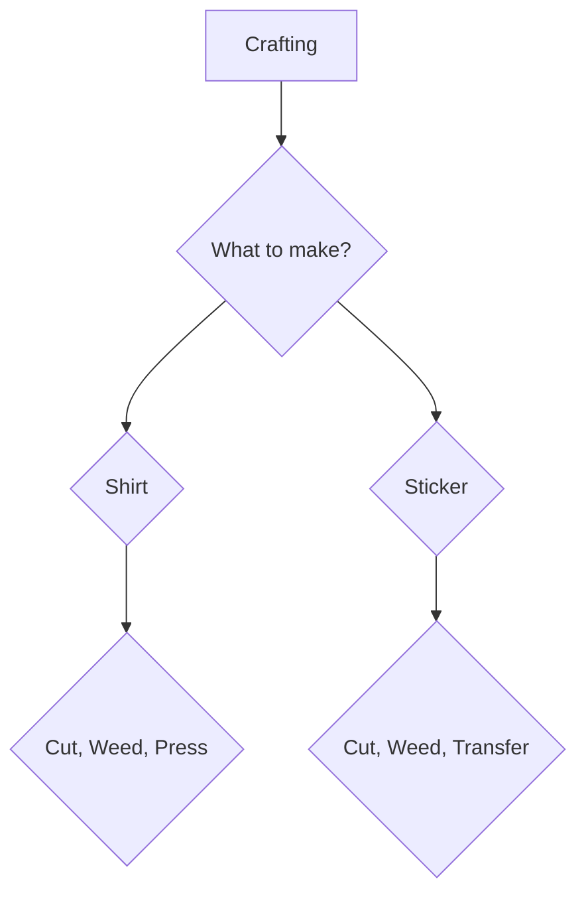

```mermaid
flowchart TD
A[Crafting] --> B{What to make?}
B{What to make?} --> C{Shirt}
B{What to make?} --> D{Sticker}
C{Shirt} --> E{Cut, Weed, Press}
D{Sticker} --> F{Cut, Weed, Transfer}
```
*A* Crafting  
*B* What to Make  
*C and D* Choices  
*E and F* Steps  
